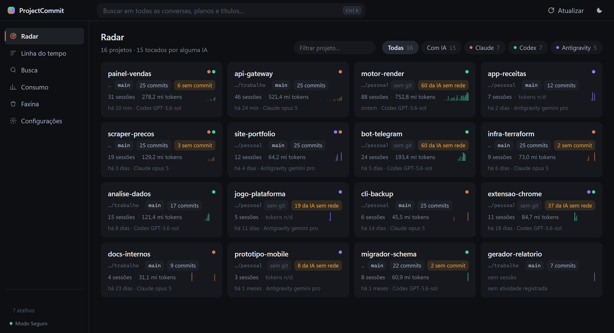
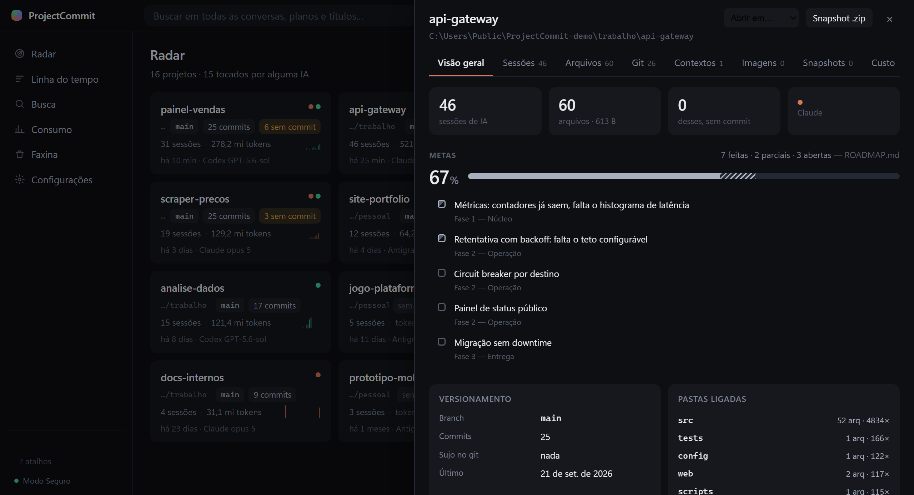

# ProjectCommit

Painel que reúne, num só lugar, o que **Claude Code**, **Codex** e **Antigravity**
fizeram nos projetos do seu PC: qual IA, em qual projeto, quando, quanto custou —
e **o que ficou sem commitar**.

Se você ataca os mesmos projetos com três assistentes diferentes, o histórico fica
espalhado por três formatos, em três pastas, sem nada que responda *"onde a IA
escreveu e o que ainda não virou versão?"*. Era essa a pergunta sem dono.



> Interface em português. Windows, por enquanto — as três IAs guardam os dados em
> `%USERPROFILE%`, e os caminhos ainda não foram generalizados para Linux/macOS.
>
> As capturas usam projetos de demonstração, não dados reais.

---

## O que ele mostra

**Radar** — todos os projetos em cards, ordenados por atividade: quais IAs tocaram,
estado do git, sessões, tokens e uma faixa dos últimos 30 dias. O que está sendo
trabalhado **agora** ganha um selo ao vivo.

**Visão geral do projeto** — metas e porcentagem lidas do `ROADMAP.md` do próprio
projeto, pastas que as IAs realmente editam, marcadores deixados no código e o
estado do versionamento. Mais o **dossiê**: um Markdown com tudo isso, para colar
numa conversa nova e a próxima IA não começar do zero.



A barra mostra a conta, não um número solto: o trecho sólido são as metas feitas e o
listrado é a metade que as parciais (`[~]`) valem.

**Arquivos** — quais arquivos cada IA editou e quais **ainda não foram commitados**,
com ordenação por peso, data ou número de escritas, e filtro por tipo. Dá para
commitar só o que a IA mexeu, sem levar junto o que você editou à mão.

**Linha do tempo** — as mensagens das três IAs em ordem, **com os commits
intercalados**: você pediu → a IA trabalhou → isso virou versão. Ou não virou.

**Busca** — dentro de tudo: o que você pediu, o que a IA respondeu, títulos, planos
e arquivos de contexto. Clicar num trecho abre a conversa *naquela* mensagem.

**Consumo** — tokens e custo por dia, por conversa e por modelo. Os preços você
preenche; nada vem com valor de fábrica.

**Faxina** — projetos onde a IA escreveu e **não existe git nem snapshot**, com um
botão que zipa só os arquivos tocados.

---

## Privacidade

O programa lê as bases das IAs e **nunca escreve nelas**. É a regra que mais moldou
o código:

- todo acesso a SQLite de terceiro passa por uma abertura somente-leitura, com
  `immutable=1` quando não há WAL ativo — porque `mode=ro` sozinho ainda cria o
  arquivo `-shm` e mudaria o `mtime`;
- **nada sai da sua máquina.** O servidor sobe em `127.0.0.1` numa porta efêmera,
  não há telemetria e não há chamada de rede;
- índice, configurações, snapshots e dossiês ficam em
  `%LOCALAPPDATA%\ProjectCommit`, nunca dentro dos seus projetos.

Dá para conferir: tire um retrato de tamanho e data de `~/.claude`, `~/.codex` e
`~/.gemini`, rode uma varredura completa e compare. Tem que dar zero alterados.

**Modo Seguro** vem ligado. Com ele, `git init`, `git commit` e escrita de
`.gitignore` ficam bloqueados — e o bloqueio é no servidor, não só no botão.

---

## Rodar

Precisa de **Python 3.11+** e Windows com WebView2 (já vem no Windows 11).

```bash
git clone https://github.com/plmarcos/ProjectCommit.git
cd ProjectCommit
pip install -r requirements.txt
python app.py
```

Na primeira execução, abra **Configurações** e informe as pastas onde seus projetos
moram, uma por linha. Sem isso o painel ainda funciona: os projetos em que as IAs
trabalharam aparecem sozinhos, descobertos pelo diretório gravado dentro de cada
conversa. As raízes servem para varrer pastas inteiras em busca do resto.

Outros modos:

```bash
python app.py --server --port 8777   # sem janela, para abrir no navegador
python app.py --debug                # janela com devtools
python -m core.scanner --report      # varredura pela linha de comando
```

Para gerar o `.exe`:

```bash
pyinstaller build.spec
```

---

## De onde vêm os dados

| IA | Onde | Formato |
|---|---|---|
| Claude Code | `~/.claude/projects/<slug>/<id>.jsonl` | JSONL — `cwd`, `gitBranch`, `message.usage` |
| Codex | `~/.codex/state_N.sqlite` + `sessions/**/rollout-*.jsonl` | tabela `threads`; rollouts só para prompts e imagens |
| Antigravity | `~/.gemini/antigravity/conversations/<id>.db` | tabela `steps`, blobs protobuf |

Nada disso tem formato documentado — os três foram lidos por engenharia reversa.
O caso mais interessante é o Antigravity: o conteúdo é protobuf **sem schema
público**, mas o wire format é auto-descritivo, então `core/pbwalk.py` percorre os
blobs em ~40 linhas, sem dependência nenhuma. Se o formato mudar, a conversa cai em
"projeto desconhecido" — nunca derruba a varredura.

---

## Como está montado

```
app.py                janela + servidor
core/db.py            schema do índice          core/collectors/claude.py
core/scanner.py       orquestra a varredura     core/collectors/codex.py
core/indexer.py       upserts do índice         core/collectors/antigravity.py
core/api.py           endpoints HTTP            core/gitops.py    leitura do git
core/radar.py         detecção "ao vivo"        core/actions.py   escrita (Modo Seguro)
core/touched.py       arquivos editados         core/transcript.py leitor paginado
core/metas.py         caixas do ROADMAP.md      core/sinais.py    marcadores no código
core/dossie.py        o projeto em Markdown     core/pbwalk.py    protobuf sem schema
web/                  interface (HTML/CSS/JS puro, sem build step)
```

**Python 3.11 + Flask + pywebview.** Frontend sem framework e sem etapa de build:
os gráficos são SVG escrito à mão em `web/charts.js`.

A leitura é **incremental**. JSONL é append-only, então o índice guarda
`(tamanho, mtime, último offset)` por arquivo e lê só o que cresceu — a segunda
varredura de 1,2 GB leva ~2 s, com pico de 57 MB de memória. Nenhum arquivo é
lido inteiro para a RAM; alguns rollouts do Codex passam de 1 GB.

---

## Honestidade dos números

Uma regra atravessa o projeto: **é melhor não mostrar um número do que mostrar um
número errado com confiança.**

- **Preço não vem embutido.** A tabela nasce vazia, com os modelos do seu índice
  zerados. Um preço chutado produziria um valor em dinheiro confiantemente errado.
- **Claude e Codex não medem a mesma grandeza.** O Claude grava consumo por
  mensagem; o Codex só publica o acumulado da conversa, que já traz releitura de
  contexto somada. Somar os dois inventaria um número — por isso são gráficos
  separados, cada um com a grandeza no rótulo.
- **Metas não são inventadas.** A porcentagem sai das caixas de um `ROADMAP.md` que
  *você* mantém. Sem esse arquivo, o painel mostra o modelo a seguir — nunca uma
  barra vazia em 0%.
- **Marcadores não são bugs.** A tela conta `TODO:` e `FIXME:` escritos em
  comentário, e diz exatamente isso. A primeira versão achava 47 num projeto; 28
  deles eram a palavra `BUGATTI`, e o resto era a palavra portuguesa "todo".

---

## Estado

Ferramenta pessoal que ficou útil o bastante para publicar. Funciona no cenário em
que foi construída — Windows, três IAs, algumas dezenas de projetos. Fora disso é
território não testado: se o seu caso quebrar, uma issue com o formato do arquivo
que causou o problema é muito bem-vinda.

## Licença

MIT — veja [LICENSE](LICENSE).
